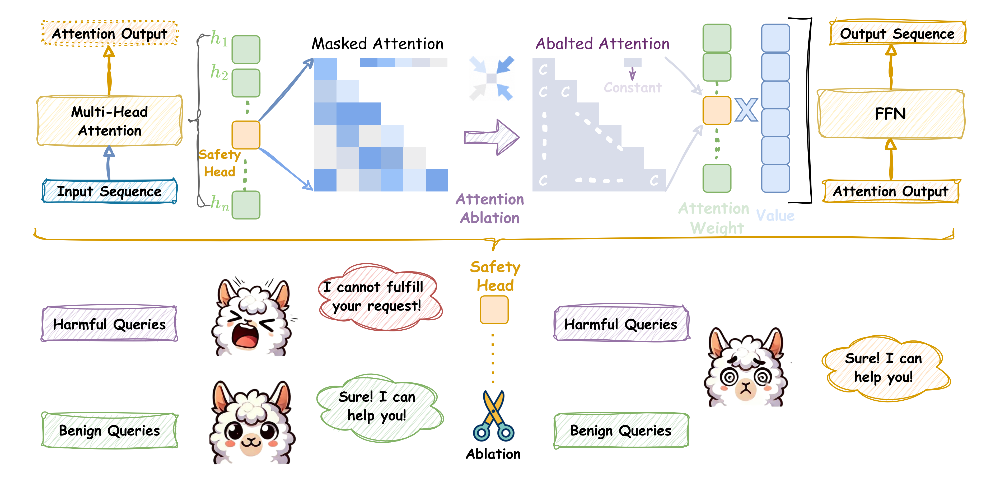

# On the Role of Attention Heads in Large Language Model Safety

    Zhenhong Zhou1, 
    Haiyang Yu1, 
    Xinghua Zhang1, 
    Rongwu Xu3,
    Fei Huang1,
    Kun Wang2,
    Yang Liu4,
    Junfeng Fang2,*,
    Yongbin Li1,*,
    

    1Alibaba Group,
    2University of Science and Technology of China 
    3Tsinghua University,
    4Nanyang Technological University

---

## Abstract
Large language models (LLMs) achieve state-of-the-art performance on multiple language tasks, yet their safety guardrails can be circumvented, leading to harmful generations. In light of this, recent research on safety mechanisms has emerged, revealing that when safety representations or component are suppressed, the safety capability of LLMs are compromised. However, existing research tends to overlook the safety impact of multi-head attention mechanisms, despite their crucial role in various model functionalities. Hence, in this paper, we aim to explore the connection between standard attention mechanisms and safety capability to fill this gap in the safety-related mechanistic interpretability. We propose a novel metric which tailored for multi-head attention, the Safety Head ImPortant Score (Ships), to assess the individual heads' contributions to model safety. Based on this, we generalize Ships to the dataset level and further introduce the Safety Attention Head AttRibution Algorithm (Sahara) to attribute the critical safety attention heads inside the model. Our findings show that the special attention head has a significant impact on safety. Ablating a single safety head allows aligned model ($\textit{e.g.}$, $\texttt{Llama-2-7b-chat}$) to respond to **$16\times \uparrow$** more harmful queries, while only modifying **$0.006\% \downarrow$** of the parameters, in contrast to the $\sim 5\% $ modification required in previous studies. More importantly, we demonstrate that attention heads primarily function as feature extractors for safety and models fine-tuned from the same base model exhibit overlapping safety heads through comprehensive experiments. Together, our attribution approach and findings provide a novel perspective for unpacking the black box of safety mechanisms within large models. Our code is available at https://github.com/ydyjya/SafetyHeadAttribution.

---

## Brief Intro

---

## Quick Start

### Install the required packages
`pip install requirements.txt`

### Ships On Specific Harmful Queries
This part corresponds to Section 3 of our paper, and the main coding in `lib/SHIPS`.

In `lib/SHIPS/get_ships.py`, 

For a mini demo, see `Ships_quick_start.ipynb`. 
In the mini demo, the primary hyperparameters include 

### Ships On Dataset Level
This part corresponds to Section 4 of our paper, and the main coding in `lib/Sahara`

In `lib/Sahara/attribution.py`, 

For a mini demo, see `Generalized_Ships.ipynb`. 
In the mini demo, the primary hyperparameters include 

### Ablated Safety Attention Head
By *Ships* or *Generalized Ships*, we can attribute safety heads. Then, we can ablate safety head following `Surgery.ipynb` to obtain an ablated LLMs. The weights also can be load from `transformers.AutoModel` instead of `custommodel`.

